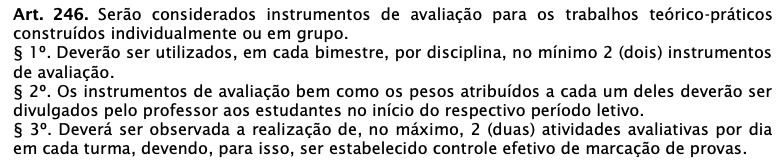

# Programação de Sistemas para Internet
Prof. Romerito Campos

---

# Apresentação

- Aulas
- Avaliação
- Materiais
- Código de conduta
- Ementa

---
# Apresentação - Aulas

- Todas as aulas são em laboratório
- A disciplina exige a escrita de código para construção de projetos
- Os códigos são parte fundamental do processo
- Importante notar que há bastante teoria por trás de cada projeto/código escrito

---

# Avaliação

- Avaliação individual
- Projetos

---

# Materiais

- Livros disponibilizados gratuitamente
- Conteúdo de blogs
- Vídeos no Youtube

**Observação**: não há material didático para disciplina. É necessário que busquemos alternativas na web para sanar essse problema.

---

# Código de Conduta

---

# Código de Conduta

---

# Código de Conduta

Em resumo: **cola**.

---
# Código de Conduta

- Uso de smartphone
- Jogos durante as aulas
- Muita saída de laboratório
- Realizar outros trabalhos em laboratório

---

# Ementa

1. Introdução
1.1. Como a Web funciona
1.2 Padrões Web
 
---

# Ementa

2. HTML
2.1. Sintaxe
2.2. Títulos
2.3. Parágrafo
2.4. Links 2.5. Listas 2.6. Imagens
2.7. Tabelas
2.8. Formulários
2.9. Informações meta
2.10.Seções

---

# Ementa

3. Formatação com CSS
3.1. Sintaxe
3.2. Formas de inclusão
3.3. Textos, cores e fontes
3.4. Plano de fundo
3.5. Dimensões, espaçamentos e bordas
3.6. Lista
3.7. Posicionamentos
3.8. Subclasses

---

# Ementa

4. Arquitetura da informação
4.1. Introdução
4.2. Comportamento e necessidades do usuário
4.3. Estruturas de navegação
4.4. Estruturas de busca
4.5. Padrões de design
4.6. Navegação em aplicações web ricas
4.7. Pesquisa e identificação das informações dos usuários
4.8. Projeto de arquitetura da informação