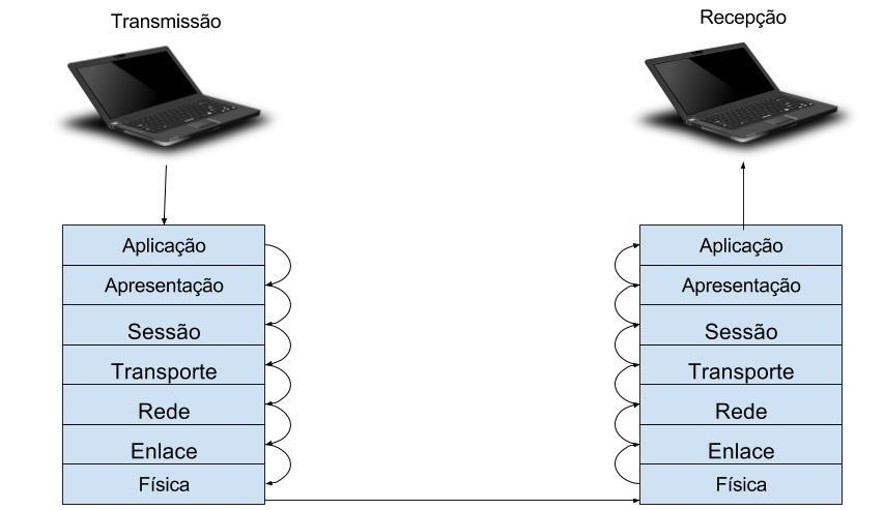
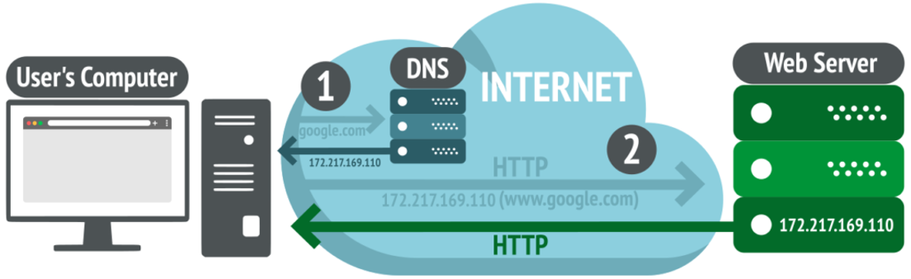

# Design Web e Arquitetura da Informação
Prof. Romerito Campos

---

# Conteúdo

- Conceitos Básicos
  - Internet
  - IP
  - DNS
  - Backbone
  - Roteamento
- Servidor Web

---

# O que é Internet? 

---

# Visão Geral

## Fonte: https://www.nic.br/noticia/na-midia/trafego-da-internet-brasileira-na-pandemia-quais-foram-os-impactos/

---

# ISP - Provedores de Internet

- Oferece serviços e conexão com a Internet.
- Seu smartphone, TV, notebook e etc está conectado a Internet por meio de provedor de Internet – ISP
- Qualquer comunicação que façamos via internet passa pelo ISP

- **Curiosidade**: Como checar meu ISP?
  - [Veja o serviço](https://www.whoismyisp.org/)

--- 

# Backbone

- Backbone (Espinha dorsal)

- É responsável por interligar servidores (Máquinas) ao redor do mundo por meio de cabos de altíssima velocidade de transferência

- Utiliza-se de cabos submarinos e também cabos no subsolo.

- **Curiosidade**: Ver cabos submarinos ativos
  - [Link para servço](https://www.submarinecablemap.com/)
  
---

# Roteador

- Responsáveis pelo tráfego da internet

- Recebem e encaminham pacotes de dados de fonte para destino
 
- Aplicam protocolos de roteamento para realizar o roteamento dos pacotes de forma mais eficiente

---

# Como a internet é estruturada e onde vamos trabalhar?

---

# Modelo OSI

- Modelo teórico padrão para os protocolos de rede

- Protocolos são regras de comunicação para conectar dois computadores 

- O modelo OSI organiza os protocolos em camadas

---

# Modelo OSI

## Fonte: https://www.alura.com.br/artigos/conhecendo-o-modelo-osi

---

# Como um computador reconhece outro e como eles se comunicam?

---

# Protocolos de Comunicação

- Como um computador reconhece outro e como eles se comunicam?

> A resposta está nos protocolos presentes na camada de transporte e camada de rede do Modelo OSI.

> Especificamente, a resposta está nos protocolo /IP.

---

# Protocolos de Comunicação

- O Protocolo IP está localizado na camada de rede

- O número IP é atribuído a cada dispositivo conectado a Internet de maneira a identifica-lo.

- Os roteadores vão receber e encaminhar mensagens com base nesses números.

---

# Endereçamento IP

## Fonte: https://www.freecodecamp.org/portuguese/news/ficha-informativa-de-sub-redes-mascara-de-sub-rede-24-30-26-27-29/

---

# Endereçamento IP

- Essa notação de IP`s é interessante para o ser humano?

- Quantos números de IP você conhece?

> Uma solução para facilitar o uso de computadores conectados a rede sem necessidade de se preocupar com número IP é o DNS.

---

# Servidor de DNS

## Fonte: https://linuxiac.com/what-is-web-server/

---

# Servidor de DNS

- Sistema de Nome de Domínio

- Converter endereços IP`s em nomes de domíno.

- Por exemplo, que site é este abaixo? Alias, o IP abaixo está associado a que site?
  
> 172.217.28.3

---

# Servidor Web e Requests

- Servidor Web é uma máquina(computador - ou um conjunto de máquinas) que está em algum lugar na Internet e armazena os dados de um Site.

- Para acessar os dados de um site: suas páginas. Fazemos requisições ao servidor por determinadas páginas.

- Como fazemos essas requisições? O browser (navegador) é uma maneira de fazer tais requisições.

---

# Resumo

- Vimos que um computador se conecta a Internet por meio do ISP
- Este **ISP** fornece serviços de Internet
- O ISP está conectado a parte da rede mundial chamada **Backbone**.
- Os computadores são identificados na rede por meio de um endereço chamado Endereço IP.
- Há um protocolo chamado **protocolo IP** que indica como os computadores utilizam este número
- Os **roteadores** são equipamentos que auxiliam na comunicação entre os computadores.

---

# Resumo
- Os números IP`s são de difícil manuseio para humanos.
- Para associar IP`s a nomes temos os **servidores DNS**
- Através do servidor de DNS, podemos encontrar uma máquina onde um site está hospedado
- Estas máquinas que hospedam sites são chamados de **Servidores Web**
- A solicitação de um página de um site via navegador (browser) é chamada de **Request**.

