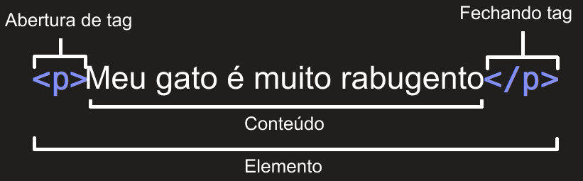

# Design Web e Arquitetura da Informação
Prof. Romerito Campos

---
<!-- 
centrarlizar slide
<style scoped>
    section {
        display: flex;
        flex-direction: column;
        justify-content: center;
        text-align: center;
    }
</style> 

<style scoped>   
    h2 {
        text-align: center;
        font-size: 15px;
        margin-top: 450px;
    }
</style>
-->


# Conteúdo

- Introdução ao HTML
- Componentes de um página
- Títulos
- Parágrafos
- listas
---

<style scoped>
    section {
        display: flex;
        flex-direction: column;
        justify-content: center;
        text-align: center;
    }
</style> 

# HTML

---

# HTML

- HyperText Markup Language: **Linguagem de Marcação de Hypertexto** [1](https://developer.mozilla.org/pt-BR/docs/Learn/Getting_started_with_the_web/HTML_basics).

- Não é uma linguagem de programação

- É utilizada para estruturação do conteúdo de uma página

- As páginas HTML são compostas de **elementos**. Este elementos podem conter texto, imagem ou algum outro item de dado

---

# HTML

- Exemplo de página HTML

<style scoped>    

    pre > * {
        font-size: 120px
    }

    pre {
        float: left;
        width: 100%;
        /* margin-right: 5px; */
        /* margin-top: 0px */
    }
    
</style>

```html
<!DOCTYPE html>
<html lang="en">
<head>
    <meta charset="UTF-8">
    <meta name="viewport" content="width=device-width, initial-scale=1.0">
    <title>Document</title>
</head>
<body>    
    <h1>Olá Mundo</h1>
</body>
</html>
```

--- 

# HTML - Anotomia de um página

- `<!DOCTYPE html>`: É a parte inicial obrigatória do documento. **Não é uma tag HTML**. Apenas indica ao navegador o tipo de documento - HTML. [1](https://www.w3schools.com/tags/tag_doctype.ASP)

- `<html> </html>`: elemento que envolve todo o conteúdo da página

- `<head> </head>`: elemento onde se coloca tudo que não for o conteúdo propriamente dito: arquivos de estilo.

- `<body></body>`: Local onde se adiciona o conteúdo propriamente dito (links, botões, imagens, textos e etc)

---
# HTML - Anatomia de uma página

- O elemento `<head></head>` permite que adicionemos coisas como:
  - `<title>Minha página</title>`: este elemento indica o título da página

- O elemento `<meta charset="UTF-8">` permite adicionar metadados. Neste exemplo, estamos definido a codifição de caracteres da página. [1](https://developer.mozilla.org/pt-BR/docs/Web/HTML/Element/meta#charset), [2](https://www.w3schools.com/html/html_charset.asp)

- Em breve vamos adicionar estilo as páginas e o local para fazer isso é no `<head> </head>`

---

# Elemento HTML

<style scoped>   
    h2 {
        text-align: center;
        font-size: 15px;
        margin-top: 450px;
    }
</style>



## [Fonte:https://developer.mozilla.org/pt-BR/docs/Glossary/Element](https://developer.mozilla.org/pt-BR/docs/Glossary/Element)

---

# Elemento HTML

- Obeserve que os elementos HTML em geral inciam e são finalizados com uma tag (Há casos onde não há essa regra)

- Eles possuem algum **conteúdo** e uma boa varidade de **[atributos](https://developer.mozilla.org/pt-BR/docs/Glossary/Attribute)**

- Estes atributos permitem modificações no comportamento do elemento ou fornecendo algum metadado.

- Há [atributos globais](https://developer.mozilla.org/pt-BR/docs/Web/HTML/Global_attributes) (todos os elementos possuem) e atributos específicos de cada elemento.

---

# Elementos HTML

- [Elemento Cabeçalho](https://developer.mozilla.org/pt-BR/docs/Learn/Getting_started_with_the_web/HTML_basics#cabe%C3%A7alhos): `<h1>, <h2>, <h3>, <h4>, <h5>, <h6>`
  - Os elementos de cabeçalhos permitem especificar que certas partes do seu conteúdo são títulos ou subtítulos
  
- [Elemento Parágrafo](https://developer.mozilla.org/pt-BR/docs/Learn/Getting_started_with_the_web/HTML_basics#par%C3%A1grafo): `<p>meu texto</p>`
  - estes elementos são utilizados para adicionar conteúdo textual de forma a serem entendidos como parágrafos de um texto.

- [Elemento Listas](https://developer.mozilla.org/pt-BR/docs/Learn/Getting_started_with_the_web/HTML_basics#listas): Elemento utilizado para criação de listas na web (veremos detalhes na prática).

---

# Práticas

## Prática 1
- Criar uma página com um cabeçalho e uma lista de livros favoritos
- Rodar o servidor `http.server` para ver a página via servidor local

---

# Práticas

## Prática 2
- Criar uma página com um cabeçalho, em seguida adicionar um resumo a esta página. 
- Adicionar uma lista de músicas favoritas
- Adicinoar um cabeçalho de nível 2 e abaixo de dele adicionar parágrafos com texto sobre os estilos musicais que você gosta.


---

# Referências

<style scoped>
    p {
        font-size: 28px
    }
</style>

Atributo HTML. (n.d.). MDN Web Docs. Retrieved March 6, 2024, from https://developer.mozilla.org/pt-BR/docs/Glossary/Attribute

Atributos Globais. (n.d.). MDN Web Docs. Retrieved March 6, 2024, from https://developer.mozilla.org/pt-BR/docs/Web/HTML/Global_attributes

Elemento. (n.d.). MDN Web Docs. Retrieved March 6, 2024, from https://developer.mozilla.org/pt-BR/docs/Glossary/Element

HTML básico. (n.d.). MDN Web Docs. Retrieved March 6, 2024, from https://developer.mozilla.org/pt-BR/docs/Learn/Getting_started_with_the_web/HTML_basics

---

# Referências

<style scoped>
    p {
        font-size: 28px
    }
</style>

HTML charset. (n.d.). W3schools.com. Retrieved March 6, 2024, from https://www.w3schools.com/html/html_charset.asp

HTML doctype declaration. (n.d.). W3schools.com. Retrieved March 6, 2024, from https://www.w3schools.com/tags/tag_doctype.ASP

(N.d.). Mozilla.org. Retrieved March 6, 2024, from https://developer.mozilla.org/pt-BR/docs/Web/HTML/Element/meta#charset