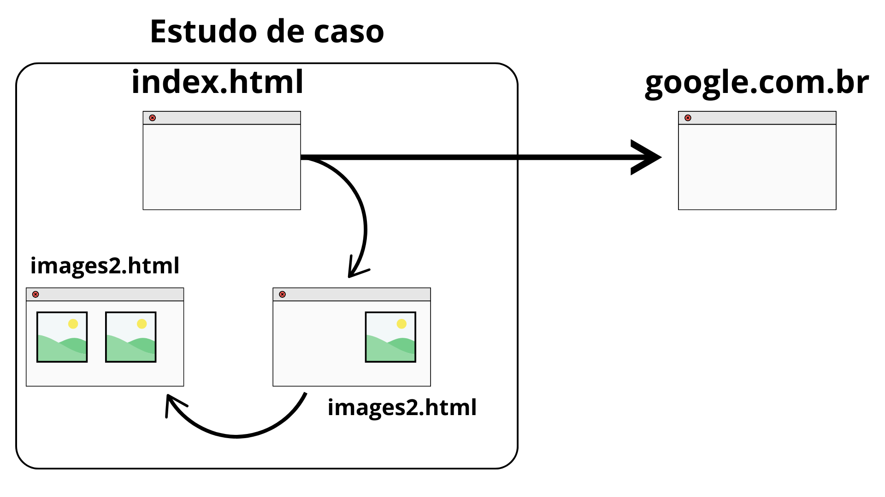
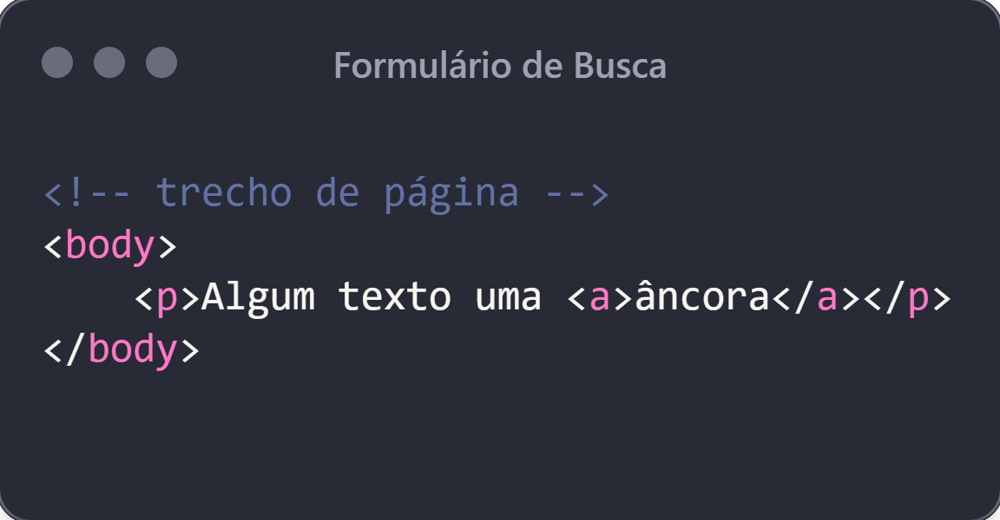
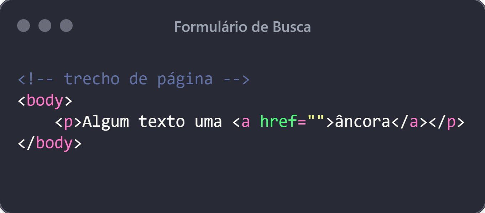
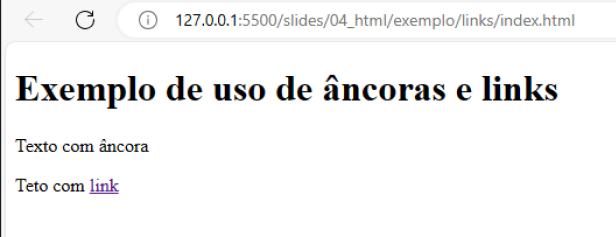
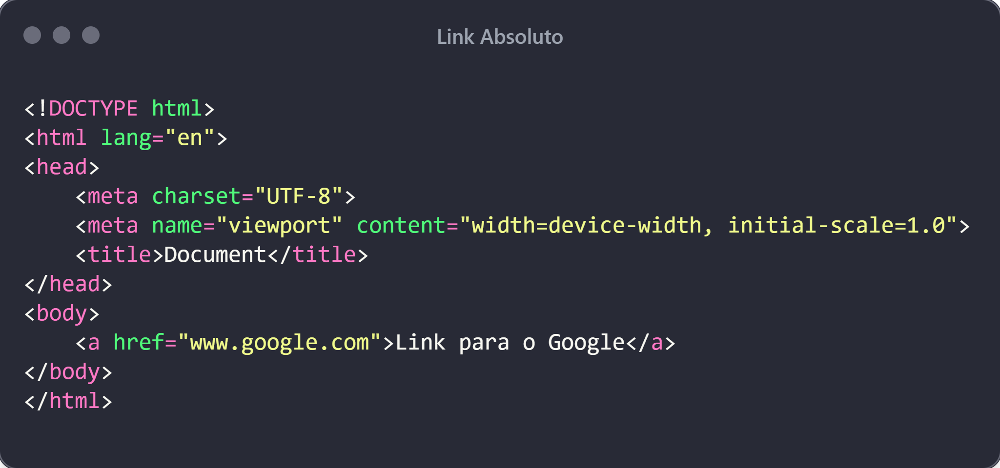
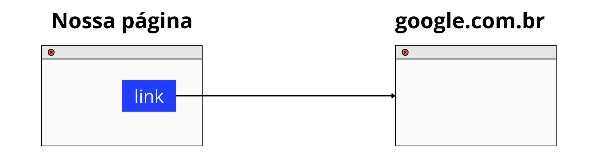

# Design Web e Arquitetura da Informação
Prof. Romerito Campos

---
<!-- 
centrarlizar slide
 

-->

# Conteúdo

- Links
- Imagens

---

 

# HTML

---

# HTML

Última aula...
- Na última aula trabalhamos com `<h1>`, `<ul>`\\`<ol>` e `
`
- Estes elementos permitem que adicionemos conteúdo em uma página como texto, títulos (seções) e também listas.
- Entretanto, uma página pode conter imagens.
- Outro ponto importante é o fato de sites terem mais de uma página (em geral)

---

# HTML

**Portanto, como podemos adicionar mais páginas ao projeto e permitir a ligação entre elas?**

**Como adicionar imagens ao nosso projeto?**

---

# HTML - Estudo de Caso

---
# HTML  - Estudo de Caso

- Neste contexto, vamos ter:
  - Navegação em páginas internas do projeto
  - Navegação para páginas fora do projeto
  - Inclusão de imagens nas páginas

- Cada um desses requisitos é alcançado pelo combinação dos elementos e seus **atributos**

---

# HTML - Links e âncoras

- Há um elemento definido pela tag `<a>` que é definido como âncora(*anchor*).
- A aplicar a tag `<a>` com algum conteúdo, indicamos que estamos definido uma âncora.

---
# HTML - Links e âncoras

- É possível mudar a semântica do elemento `<a>` através de um de seus atributos: **href**

- Ao adicionar este atributo, estamos criando um *link* que permite realizar navegação entre páginas

---

# HTML - Links e âncoras

- Até aí tudo bem. Mas na prática qual a diferença?
- A diferença visual na página é a ilustrada abaixo:

---

# HTML - Tipos de links

- **Links absolutos   **

---
# HTML - Tipos de Links

- Exemplo de uso de **links absolutos** em uma página:

---
# HTML - Tipos de Links

- Os **links absolutos** permite navegar de nossas páginas para outras páginas, por exemplo.

---

# HTML - Tipos de Links

- **Links relativos**
  - O contexto dos links relativos é permitir a nevegação dentro do próprio site. 
- Considere a figura inicial desta aula. 
  - Há páginas que possuem setas (ligações dentro do próprio site)

---

# HTML - Tipos de Links

---
# Referências

