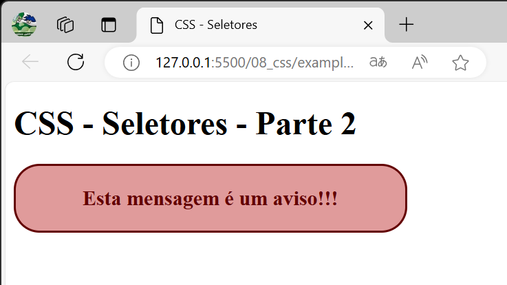

# Design Web e Arquitetura da Informação
Prof. Romerito Campos

---
<!-- 
centrarlizar slide
<style scoped>
    section {
        display: flex;
        flex-direction: column;
        justify-content: center;
        text-align: center;
    }
</style> 

<style scoped>   
    h2 {
        text-align: center;
        font-size: 15px;
        margin-top: 450px;
    }
</style>

pre {
        float: left;
        width: 45%;
        margin-right: 5px;
        margin-top: 0px
    }

para imagens
<style scoped>
    section {
        display: flex;
        flex-direction: column;
    }
    img[src*='png']{
        border: 1px solid black;
        margin: 0 25%;
        border-radius:25px
    }
</style> 

-->


# Plano

- **Objetivo:** Compreender o uso do seletores de classes e atributos

- Conteúdos:
    - Seletor de classes
    - Utilização de múltiplas classes
    - Seletor de id

---

<style scoped>
    section {
        display: flex;
        flex-direction: column;
        justify-content: center;
        text-align: center;
    }
</style> 

# CSS - Seletor de Classes

---

# CSS - Seletor de Classes

- O seletor de classes é importante para utilizarmos em contextos onde não queremos aplicar um estilo a todos os elementos de um mesmo tipo. 

- Imagine que queiramos criar alguns parágrafos com mensagens de aviso (warning):
    - O fundo do parágrafo com uma cor vermelha e o texto em negrito

- É neste cenário que teremos o bom uso de classes (na verdade, utilizamores sempre esta abordagem)

--- 

<style scoped>
    section {
        display: flex;
        flex-direction: column;
    }
    img[src*='png']{
        border: 1px solid black;
        margin: 0 25%;
        border-radius:25px
    }
</style> 


# CSS - Seletor de Classe

- Exemplo:



---

# CSS - Seletor de Classe

- Para alcançar o exemplo anterior, podemos definir uma classe:

```css
.warning { /* definição das propriedades/valores */ }
```

- Aplicar a classe no elemento HTML que será estilizado:

```html
<p class="warning">Esta mensagem é um aviso!!!</p>
```

- Observe o uso do atributo **class**. Ele permite usar as classes definidas

---

# CSS - Seletor de Classe

- O exemplo anterior ilustra a ideia central por trás do seletor de classe

- Definimos classes que podem ser aplicadas de acordo com um projeto de interface padronizado e consistente

- No próximo slide, o código do exemplo é apresentado na íntegra

---

# CSS - Seletor de Classe

- Exemplo:

```css
.warning {
    background-color: rgb(224, 155, 155);
    font-weight: bold;
    font-size: 20px;
    text-align: center;
    color: rgb(99, 0, 0);
    padding: 20px;
    width: 50%;
    border-radius: 25px;
    border: 2px solid rgb(99,0,0);
}
```

--- 

# CSS - Seletor de Classe

- Combinação de elemento com classe.
    - Permite ao mesmo elemento ter diferentes estilos

- Vamos usar o exemplo de avisos (red), confirmação (azul) e sucesso (verde) em operações.


