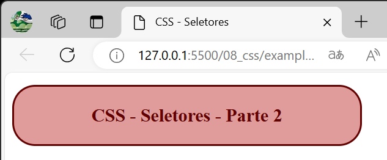
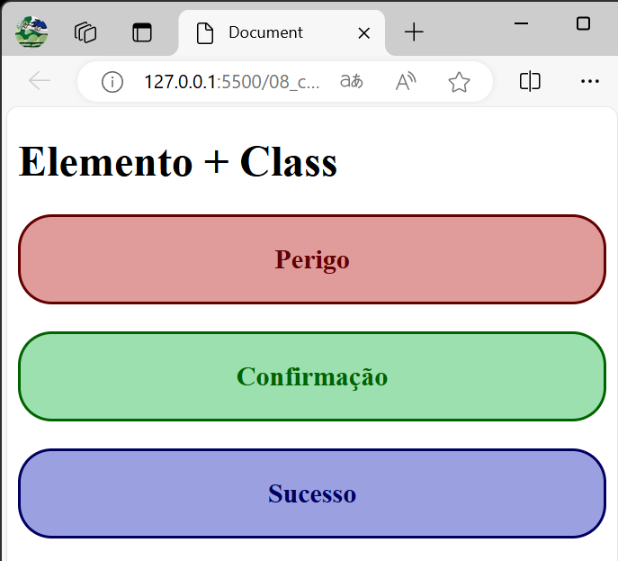
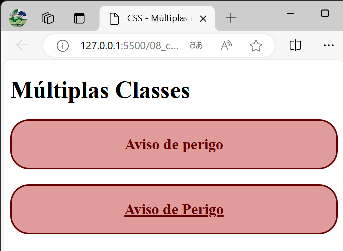
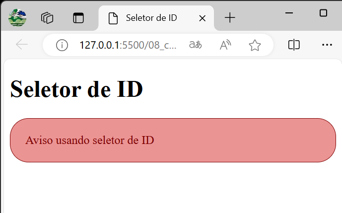

# Design Web e Arquitetura da Informação
Prof. Romerito Campos

---
<!-- 
centrarlizar slide
<style scoped>
    section {
        display: flex;
        flex-direction: column;
        justify-content: center;
        text-align: center;
    }
</style> 

<style scoped>   
    h2 {
        text-align: center;
        font-size: 15px;
        margin-top: 450px;
    }
</style>

pre {
        float: left;
        width: 45%;
        margin-right: 5px;
        margin-top: 0px
    }

para imagens
<style scoped>
    section {
        display: flex;
        flex-direction: column;
    }
    img[src*='png']{
        border: 1px solid black;
        margin: 0 25%;
        border-radius:25px
    }
</style> 

-->


# Plano

- **Objetivo:** Compreender o uso do seletores de classes e atributos

- Conteúdos:
    - Seletor de classes
    - Utilização de múltiplas classes
    - Seletor de id

---

<style scoped>
    section {
        display: flex;
        flex-direction: column;
        justify-content: center;
        text-align: center;
    }
</style> 

# CSS - Seletor de Classes

---

# CSS - Seletor de Classes

- O seletor de classes é importante para utilizarmos em contextos onde não queremos aplicar um estilo a todos os elementos de um mesmo tipo. 

- Imagine que queiramos criar alguns parágrafos com mensagens de aviso (warning):
    - O fundo do parágrafo com uma cor vermelha e o texto em negrito

- É neste cenário que teremos o bom uso de classes (na verdade, utilizamores sempre esta abordagem)

--- 

<style scoped>
    section {
        display: flex;
        flex-direction: column;
    }
    img[src*='png']{
        border: 1px solid black;
        margin: 0 25%;
        border-radius: 25px
    }
</style> 


# CSS - Seletor de Classe

- Exemplo:


---

# CSS - Seletor de Classe

- Para alcançar o exemplo anterior, podemos definir uma classe:

```css
.warning { /* definição das propriedades/valores */ }
```

- Aplicar a classe no elemento HTML que será estilizado:

```html
<p class="warning">Esta mensagem é um aviso!!!</p>
```

- Observe o uso do atributo `class`. Ele permite usar as classes definidas

---

# CSS - Seletor de Classe

- O exemplo anterior ilustra a ideia central por trás do seletor de classe

- Definimos classes que podem ser aplicadas de acordo com um projeto de interface padronizado e consistente

- No próximo slide, o código do exemplo é apresentado na íntegra

---

# CSS - Seletor de Classe

- Exemplo:

```css
.warning {
    background-color: rgb(224, 155, 155);
    font-weight: bold;
    font-size: 20px;
    text-align: center;
    color: rgb(99, 0, 0);
    padding: 20px;
    width: 50%;
    border-radius: 25px;
    border: 2px solid rgb(99,0,0);
}
```

--- 

<style scoped>
    section {
        display: flex;
        flex-direction: column;
    }
    img[src*='png']{
        border: 1px solid black;
        margin: 0 25%;
        border-radius: 25px
    }
</style> 

# CSS - Seletor de Classe

- A classe definida como no exemplo anterior pode ser aplicada a qualquer elemento HTML. Por exemplo `<h1 class='warning'><h1>`:



---

# CSS - Seletor de Classe

- Imagine que queiramos restringir o uso da classe `.warning` a parágrafos específicos com avisos.
    - Aviso de perigo (Operação como remover algo)
    - Aviso de confirmação 
    - Aviso de sucesso em uma operação

- É possível utilizar o seletor de tipos (usar o próprio elemento `<p>` ) em conjunto com a classe.

- Vejamos no próximo slide o resultado e em seguida o código.

---

<style scoped>
    section {
        display: flex;
        flex-direction: column;
    }
    img[src*='png']{
        border: 1px solid black;
        margin: 0 25%;
        border-radius: 25px
    }
</style> 

# CSS - Seletor de Class



---

# CSS - Seletor de Classes

- No exemplo anterior, utilizamos uma regra para parágrafos em geral e regras para os parágrafos de acordo com os avisos.

```css
p {
    padding: 20px;
    border-radius: 25px;
    text-align: center;
    font-weight: bold;
    font-size: 20px;
}
```
- Regras específicas por aviso no próximo slide

---
# CSS - Seletor de Classes

- No exemplo anterior, utilizamos as seguintes classes:

```css
p.warning { background-color: rgb(224, 155, 155); color: rgb(99, 0, 0);
    border: 2px solid rgb(99,0,0);
}

p.confirmation { background-color: rgb(155, 224, 174); color: rgb(0, 99, 0);
    border: 2px solid rgb(0,99,0);
}

p.success { background-color: rgb(155, 161, 224); color: rgb(0, 0, 99); 
    border: 2px solid rgb(0,0,99);
}
```
---

# CSS - Seletor de Classes

- As regras definidas indicam que o estilo será aplicado nos elementos `<p>` quando eles usarem as classes definidas `.warning`, `.confirmation`, e `.success`.

- Caso você tente aplicar uma das classes anteriores em outro elemento HTML, não haverá alteração do estilo.

```html
<h1 class="warning">Elemento + Class</h1>
```

- A declaração a acima não aplica as propriedades da classe `.warning `ao `<h1>`

---

<style scoped>
    section {
        display: flex;
        flex-direction: column;
        justify-content: center;
        text-align: center;
    }
</style> 


# CSS - Múltiplas classes

---

# CSS - Múltiplas classes

- Imagine o cenário anterior com os avisos. Há situações onde podemos realçar os avisos com mais algum efeito visual utilizando CSS.

- Para realizar esta tarefa, podemos utilizar múltiplas classes de modo a incrementar o estilo de um elemento

- Considerando duas classes hipoteticas estilo1 e estilo2 podemos:

```html
<p class="estilo1 estilo2"> Texto estilizado</p>
```

---

# CSS - Múltiplas classes

- Ao utilizar múltiplas classes, incluímos **um espaço** para separá-las no código HTML.

- No entanto, ao difinir as classes no código CSS vamos ter algo como(considerando os estilos 1 e 2 hipotéticos):

```css
.estilo2{
    /* propriedades e valores */
}
.estilo1.estilo2 {
    /* propriedades e valores */
}
```

---

# CSS - Múltiplas classes

- Para tornar mais claro o uso de múltiplas classes, vamos retomar o exemplo dos avisos.

- Já temos as regras para três tipos de aviso

- Agora, uma nova tarefa é adicionar o texto com sublinhado em algumas situações epecíficas (não em todas).
    - Este cenário é perfeito para o uso de múltiplas classe dentro da nossa sequência lógica até aqui

- Já temos parte do código pronto

---

<style scoped>
    section {
        display: flex;
        flex-direction: column;
    }
    img[src*='png']{
        border: 1px solid black;
        margin: 0 25%;
        border-radius: 25px
    }
</style> 

# CSS - Múltiplas classes
- O resultado será o seguite (no próximo slide tem o código):



--- 

# CSS - Múltiplas classes 

- Para obter o efeito acima, utilizamos a seguinte regra CSS
```css
p.warning.underlined {
    text-decoration: underline;
}
```
- Aplicamos a regra nos parágrafos conforme:
```html
<p class="warning"> Aviso de perigo </p>
<p class="warning underlined"> Aviso de Perigo</p>
```

---

# CSS - Múltiplas classes

- Este é mais um recurso que pode ser usado na hora de codificar um design projetado com características com a que foi ilustrada no exemplo.

- A ordem das palavras warning e underlined neste caso é irrelavante no código html. POdemo ser da seguinte forma:

```html
<p class="underlined warning"> Aviso de Perigo</p>
```

- Há outras situações onde a ordem das classes é relevante no HTML.

---

<style scoped>
    section {
        display: flex;
        flex-direction: column;
        justify-content: center;
        text-align: center;
    }
</style> 

# CSS - Seletor de ID 

---

# CSS - Seletor de ID

- Os seletores de ID tem como base o atributo `id` que podem ser adicionados aos elementos HTML

```html
<p id="aviso">Conteúdo do aviso</p>
```

- No código acima, utilizamos o atributo `id` incluindo-o no elemnto `<p>` 

- É possível aplicar regras CSS a partir da seleção basead nos ids dos elementos

--- 

# CSS - Seletor de ID

- Considerando o código abaixo:

```html
<p id="aviso">Conteúdo do aviso</p>
```

- Utilizamos o seguinte código em CSS para aplicar mudanças nas propriedades do parágrafo

```css
#aviso {
    background-color: red;
    color: white;
}
```

--- 

# CSS - Seletor de ID

- Além de aplicarmos o símbolo **#** para identificar um ID na sintaxe do CSS.

- o seletor se refere ao valor do atributo **id**.

- A terceira diferença envolve a não possibilidade de ter dois id's com valores iguais no código HTML.

---

# CSS - Seletor de ID

- Dado o código abaixo, o documento HTML só vai considerar o ID para o segundo parágrafo. 

```html
<p id="aviso">Conteúdo do aviso</p>
<p id="aviso">Conteúdo do aviso</p>
```

- No entanto, o CSS ignora isso e aplica as propriedades aos dois elementos HTML.

- Caso o id seja utilizado em código JavaScript, essa duplicada pode ser problemática.

---

<style scoped>
    section {
        display: flex;
        flex-direction: column;
    }
    img[src*='png']{
        border: 1px solid black;
        margin: 0 25%;
        border-radius: 25px
    }
</style> 

# CSS - Seletor de ID

- Exemplo de seletor de ID


---

# CSS - Seletor de ID

- Código do exemplo anterior:

```css
 #aviso {
    background-color: rgb(235, 148, 148);
    color: rgb(128, 0, 0);
    border-radius: 25px;
    border: 1px solid rgb(128, 0, 0);
    padding: 20px;
}
```

```html
    <p id="aviso">Aviso usando seletor de ID</p>
```

---

<style scoped>
    h3 {
        text-align: center;
    }
</style>

# CSS - Seletor de ID

### Desafio

- Desafio: escreva um regra CSS que tenha como seletor um seletor de ID.
- Aplique o seletor em elementos HTML duplicando o valor do ID nos elementos
- Veja o resultado
- Pesquisa o problema envolvendo a duplicata de ids no HTML (por duplicada ententa dois elementos cujos ids sejam iguais)

