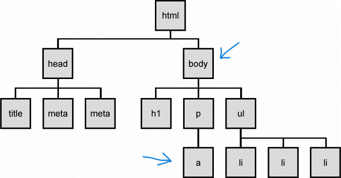
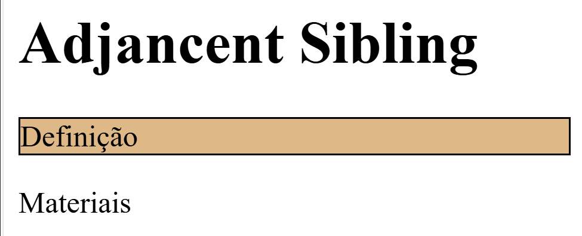
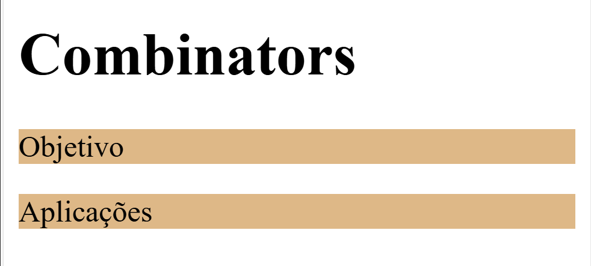

# Design Web e Arquitetura da Informação
Prof. Romerito Campos

---

# Plano de Aula

- **Objetivo:** Compreender o conceito de combinadores

- **Conteúdos**:
  - Definição
  - Descedant Selector (space)
  - child selector (>)
  - ajdacent sibling selector (+)
  - general sibling selector (~)

---

<style scoped>
    section {
        display: flex;
        flex-direction: column;
        justify-content: center;
        text-align: center;
    }
</style>

# Combinadores

---

# Combinadores

- Há varias formas de selecionar elementos HTML para alterarmos suas propriedades

- Além disso, podemos usar o conceito de combinadores e aproveitar das relações entre os elementos HTML

- Para isso temos que relembrar que o documento HTML é estrutura com uma árvore

- Veja a imagem a seguir:

---

<style scoped>
    h3 {
        margin: -40px -20px;
    }
</style>


### Fonte: (TARIQ, 2013)

---

- A imagem anterio representa a DOM Tree do código abaixo:

```html
<!DOCTYPE html>
<html lang="en">
<head>
    <meta charset="UTF-8">
    <meta name="viewport" content="width=device-width, initial-scale=1.0">
    <title>Document</title>
</head>
<body>
    <h1>Combinators</h1>
    <p><a href="#">Material Extra</a></p>
    <ul>
        <li>Combinator 1</li>
        <li>combinator 2</li>
    </ul>
</body>
</html>
```

---

- A partir da estrutura apresentada na imagem que mostra os elementos como blocos interligados e um árvore podemos estabelecer as seguintes relações:
    - Elemento possui um pai e pode ter filhos
    - Um elemento pode ter elementos irmãos
    - Um elemento pode ter descedentes

- Essas relações são utilizadas de modo que podemos combinar seletores e aplicar regras com base nas relações definidas para estes elementos 

---

- Especificamente, os combinadores abaixo são definidos com base na árvore DOM do HTML

    - **descendant selector (space):** descedentes
    - **child selector (>):** pai-filho
    - **adjacent sibling selector (+):** irmaão mais próximo
    - **general sibling selector (~):** irmão em geral

---

<style scoped>
    section {
        display: flex;
        flex-direction: column;
        justify-content: center;
        text-align: center;
    }
</style>

# descendant selector (space):
## Combinador para descendentes
---

# descendant selector (space):

- Este combinador considera a descedencia entre elementos

- Analise o código abaixo:

```css
body a {
    color: red
}
```

- Este trecho de código diz que qualquer âncora que for descedente do elemento `body` terá uma propriedade alterada

---



- A relação vai envolver os dois elementos indicados. O `<a>` será modificado

---

- Podemos ter relações mais complexas de descendência envolvendo classes em uma árvore maior. Por exemplo:

```html
<body>
    <div class="container">
        <ul>
            <li><a class="btn" href="">Combinador 1</a></li>
            <li><a class="btn" href="">Combinador 1</a></li>
            <li><a class="btn" href="">Combinador 1</a></li>
        </ul>
    </div>
</body>

```
---

- No código anterior, poderíamos aplicar uma cor diferente para os links a `class=btn` condiconado ao pertencimento a estrutra que envolvesse seus ancestrais.

```css
ul li .btn {
    color: red
}
```

- Neste caso, vamos modificar a âncora que for descedente de `li` e `ul` 

- Um bom exercício é desenhar a árvore DOM do exemplo HTML para este caso.

---

<style scoped>
    section {
        display: flex;
        flex-direction: column;
        justify-content: center;
        text-align: center;
    }
</style>

# child selector (>)
## Combinador pai-filhos

---

# child selector (>)

- Este combinador também utiliza a relação de descendenência, mas apenas de pai para filho

- O filho de um elemento vai ser estilizado com base na combinação do seletor de seu pai e o seu.

- Ele é uma forma mais restrita do combinador de descendencia geral

---

- Considere o código abaixo:

```html
<div class="container">
    <ul>
        <li>Teste 1</li>
        <li>Teste 2</li>
    </ul>
    <ul class="lista">
        <li>Teste 1</li>
        <li>Teste 2</li>
    </ul>
</div>
```

- Como podemos estilizar uma lista que é um elemento filho do `.container`, mas precisa ter a `class=lista`

---

- Podemo usar o combinador pai-filho

```css
.container > ul.lista {
    background-color: green;
}
```

- Neste caso, vamos considerar o elemento filho do `.container` (que é uma `div`) que seja uma lista (`ul`). Além disso, precisa ter a classe `.lista` vinculada.

---


<style scoped>
    section {
        display: flex;
        flex-direction: column;
        justify-content: center;
        text-align: center;
    }
</style>

# adjacent sibling selector (+)
## Combinador de irmão mais próximo

---

# adjacent sibling selector (+)

- Este seletor observa a relação entre elementos 
```html
<!-- trecho de código HTML -->
<div>
    <h1>Adjancent Sibling</h1>
    <p>Definição</p>
    <p>Materiais</p>
</div>
```
- Neste exemplo, temos relação de elementos `<h1>` e `<p>` que são considerados elementos irmãos considerando que ambos são filhos da mesma `div`.

---

- Podemos considerar essa relação para aplicarmos seletores e incluir estilos nos elementos. 

- Imagine que você deseja adicionar uma cor de fundo (`background-color`) ao parágrafo que é o primeiro irmão de um elemento. O código abaixo resolve este problema:

```css
h1 + p {
    background-color:burlywood;
    border: 1px solid;
}
```

- **Exercício:** Aplique este estilo e veja o que acontece.

---

<style scoped>
    img {
        border: 1px solid black;
        border-radius: 25px;
    }

    h3 {
        display: flex;
        position: absolute;
        top: 50%;
        left: 80%;
        rotate: -90deg;
        font-size: 24px
    }
</style>

- Se você fez a atividade no final do slide anterior, o resultado foi algo como a imagem abaixo:



### Fonte: própria.

---

- **Exercício:** Pesquisa por uma situação onde usar o seletor de irmão mais próximo seja a solução adequada para estilizar um elemento.

---
<style scoped>
    section {
        display: flex;
        flex-direction: column;
        justify-content: center;
        text-align: center;
    }
</style>

# general sibling selector (~)
## Combinador de irmão em geral

---

# general sibling selector (~)

- Este combinador também leva em consideração a relação entre elementos irmãos. No entanto, ele não considera apenas o elemento mais próximo.

- Pegando o exemplo utilizando no combiandor anterior:

```html
<!-- trecho de código HTML -->
<div>
    <h1>Adjancent Sibling</h1>
    <p>Definição</p>
    <p>Materiais</p>
</div>
```

---

- Podemos aplicar estilos a todos os parágrafos que são irmãos do elemento `<h1>`

```css
h1 ~ p {
    background-color:burlywood;
    border: 1px solid; 
}
```

- A diferença entre o combinador baseado em elementos irmãos considera o mais próximo eos irmãoes em geral é bem sútil.

- Pode ser muito útil para estilizar elementos que estão vinculados ao mesmo pai.

---

<style scoped>
    img {
        border: 1px solid black;
        border-radius: 25px;
    }

    h3 {
        display: flex;
        position: absolute;
        top: 50%;
        left: 80%;
        rotate: -90deg;
        font-size: 24px
    }
</style>

- O resultado do código anterior é:



### Fonte: própia.

---
# Referências

TARIQ. Document Object Model (DOM). Disponível em: <https://tariqaustralia.wordpress.com/2013/03/01/document-object-model-dom/>. Acesso em: 22 aug. 2024.


