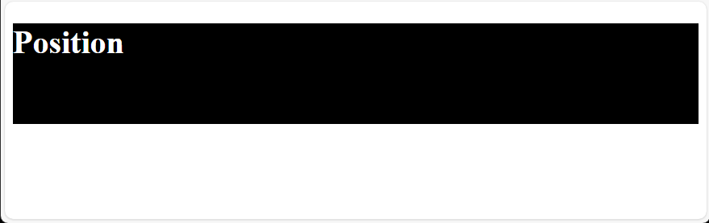
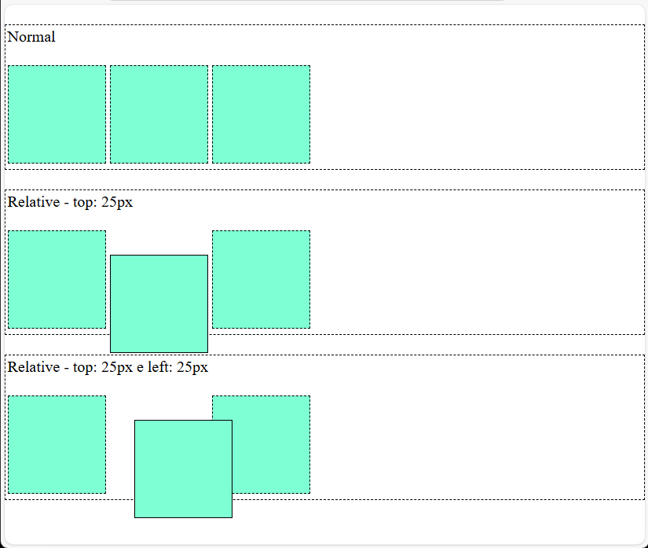
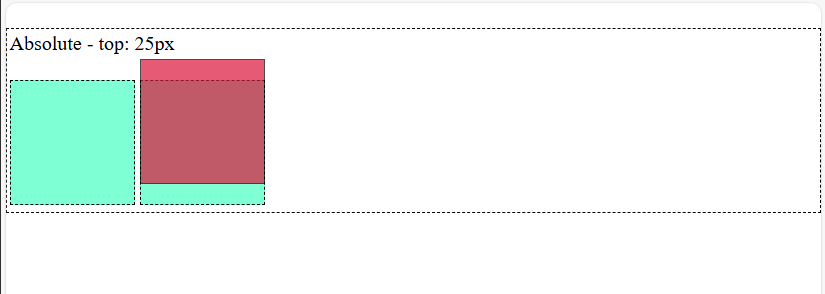
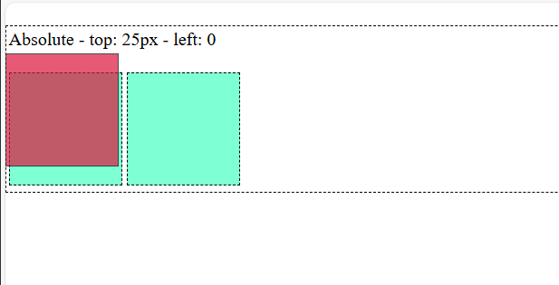
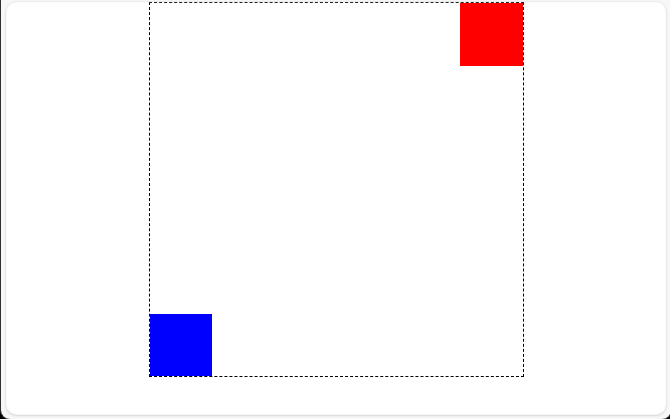

# Design Web e Arquitetura da Informação
Prof. Romerito Campos

---

# Plano de Aula

- **Objetivo:** Compreender o da propriedade `position` 

- **Conteúdos**:
  - Posistion: definição
- Position: static, absolute, relative, sticky e fixed

---

<style scoped>
    section {
        display: flex;
        flex-direction: column;
        justify-content: center;
        text-align: center;
    }
</style>

# position

---

# position

- A propriedade `position` indica como podemos posicionar um elemento para sua renderização.

- O valor padrão desta propriedade é `position: static`.
    - Não é necessário indicar este valor
    - Todos os elementos por definição já vem com esta propriedade defindia assim.

- Há 5 positions: `static`, `relative`, `absolute`, `fixed` e `sticky`.   

---

# position

- Um conceito importante sobre position é a ideia de **Containing Block**.

- Basicamente, ele indica qual é o box que contém um elemento.

- Por exemplo, a tag `<html>` é o containing block da tag `<body>`.

- Ou seja, o containing block é o elemento pai em relação aos os elementos filhos.

---

# Position

- Exemplo de Containing Block

```html
<!-- trecho de uma página -->
<body>
    <div class="container">
    </div>
</body>
```

- A tag `<body>` é o containing block do elemento `<div>`.

---

# Position

- É importante considerar o Containing block para saber onde o elemento começa a ser desenhando.

- Vimos que os elementos são desenhados na tela considerando o **fluxo normal de renderização**.
    - Em idiomas cuja escrita é da esquerda para direita: português, inglês entre outros
    - Portanto, o fluxo normal é o mesmo da escrita

- Além disso, devemos considerar que os elementos tem níveis de `block` ou `inline`.

---
# Position

- Por que preciso saber sobre *containing block* e nível de bloco|inline?

- Para alterar o posisionamento de um elemento é necessário ter noção de onde ele inicia o seu desenho.

- Veja a imagem no próximo slide:

--- 

<style scoped>
    {
        display: flex;
        justify-content: center;
        align-items: center;
        flex-direction: column;
    }

    img {
        border-radius: 20px;
        background-color: white;
    }

    ul {
        display: flex;
        width: 100%
    }

</style>

- Vejamos este exemplo:



- Ele contém uma `div` com um `h1` dentro conforme o código a seguir.

---

- Código do exemplo anterior

```html
<body>
    <div>
        <h1>Position</h1>
    </div>
</body>
```

- O containing block da `div` é o `body`.

- Ele está no fluxo normal de renderização: esquerda para direita.

- O ponto inicial da div é `top: 0` e `left: 0`.
    - canto superior esquerdo do `body`

---

<style scoped>
    ul + p {
        background-color: yellow;
        height: 80px;
        text-align: center;
        padding-top: calc(30px);
        border-radius:25px;
    }
</style>

- Essa noçãoé importante porque a propriedade position se relaciona com as properidades `left`, `top`, `bottom` e `right`.

- `top: 0` e `left:` 0 indica o canto superior esquerdo

- `top: 0` e `right: 0` indica o canto superior direito.

- Em essência utilizaremos `position` e essas propriedades citadas para:

**Retirar os elementos do fluxo normal de renderização**

---

<style scoped>
    section {
        display: flex;
        flex-direction: column;
        justify-content: center;
        text-align: center;
    }
</style>

# position: relative

---

# position: relative

- O posicionamento relativo permite que se retire o elemento do fluxo normal em relação ao seu posicionamento original.

- Ao sair do local que seria sua posição original, o espaço que o elemento deveria ocupar é mantido.

- Vejamos um exemplo para entender essas definições [Código-Fonte](./exemplos2/):


---
<style scoped>
    section {
        display: flex;
        justify-content: flex-start;
        align-items: center;
        gap:20px
    }

    ul {
        display: flex;
        flex-direction: column;
        align-items:flex-start;
        height: 100%;
        align-self: flex-start;
    }

</style>

- Na imagem temos:
    - Fluxo Normal;
    - `position: relative` com deslocamento do elemento a partir do topo (`top: 25px`)
    - `position: relative` com deslocamento no topo e na esquerda:`top: 25px; left:25px` 



---

- No primeiro conjunto de quadrados não temos alteração no fluxo de desenho.

- No segundo caso, perceba que o elmento foi deslocado para abaixo. 
    - Ele saí de sua posição original;
    - Ultrapassa o limite da `div` que o contém;
    - Mas seu espaço original é mantido.

- No terceiro caso, acontece o mesmo que no caso dois. Além disso, temos um deslocamento da esquerda para direita.
    - Observe que o elemento sobrepós a terceira caixinha ao ser deslocamento. 

---

<style scoped>
    section pre {
        /* flex: 1 1 50%; */
        float: left;
        margin-left: 20px;
        width: 48%   
    }


</style>

- Este é o comportamento relativo.
- Segue o código que modifica os elementos apresentados.
```css
.top {
    position: relative;
    top: 25px;
    border: 1px solid;
}
```
```css
.left {
    position: relative;
    left: 25px;
    border: 1px solid;
}
```
- Como desafio, crie o exemplo completo.

---

# position: absolute

---

# position: absolute

- O posicionamento absoluto indica o local em específico onde o elemento é desenhado.

- Além disso, ele não preserva o espaço original do elemento como acontece com `position: relative`.

- Com o `position: absolute` é muito fácil compreender a ideia de **containing block** apresentado no início.

- Observe a imagem a seguir:

---

<style scoped>
    img {
        border: 1px solid black;
        border-radius: 10px;
        margin: 0 auto;  
    }
</style>

- Exemplo de `position: absolute`:



- Vejamos os detalhes.

---

- É notável que uma caixa esta sobrepondo a outroa. 

- No caso, a caixa com tom avermelhado está deslocada de sua posição. 

- Além disso, o elemento seguinte que é uma caixa ocupou seu lugar.

- Neste caso, o deslocamento aplicado (`top: 25px`) não funciona da mesma maneira que o `position: relative`.

- Observe que não definimos `left`.

- O position absolute vai usar o  **containing block** `<body>` ao invés de usar a `div`.

---

- Portanto, o elemento considera o top: 0 como sendo o limite do `body`. Ele não considera a div.

- A posição em relação a `left` permanece a posição que deveria ser a original no fluxo normal. Veja a regra CSS:

```css
.top {
    position: absolute;
    top: 25px;
    border: 1px solid;
    background-color: crimson;
    opacity: 70%;
}
```
---

- Agora considere que vamos aplicar a seguinte regra CSS:

```css
.top {
    position: absolute;
    top: 25px;
    left: 0px;
    border: 1px solid;
    background-color: crimson;
    opacity: 70%;
}
```

- Mantenha em mente que o **containing block** é o `body`

- O que será que vai acontecer? Vejamos no slide seguinte.

---

<style scoped>
    {
        display: flex;
        justify-content: center;
    }
    img {
        border: 1px solid black;
        border-radius: 10px;
        margin: 0 auto;  
    }
</style>



---

- Na imagem do slide anterior, tempos o resultado da aplicação de `position: absolute` junto com `top` e `left`.

- O elemento será posicionado a partir da esquerda (`left`) da página na posição correspondende a 0. 
    - Isso corresponde a ficar na borda da página.

- Com relação ao topo (`top`), mantém-se o distanciamento da borda superior da página.

- Isso acontece porque o **containing block** padrão para `position: absolute` é o viewport (dimensão da página). 

---

# position: relative e position: absolute

- Caso seja necessário alterar o **containing block** para um elemento com `position: absolute`, podemos relacioná-lo com o `position: relative`.

- O próximo exemplo explora a relação entre uma div ( `position: relative` ) com dois elementos filhos (`position: absolute`)

---

<style scoped>
    {
        display: flex;
        justify-content: center;
    }
    img {
        border: 1px solid black;
        border-radius: 10px;
        margin: 0 auto;  
    }
</style>



---

- O código HTML é o seguinte:

```html
<body>
    <div class="container">
        <div class="caixa top-right"></div>
        <div class="caixa bottom-left"></div>
    </div>
</body>
```

- Neste exemplo temos:
    - `.container`: `position: relative`
    - `.caixa`: `position: absolute`

---

<style scoped>
    pre {
        float: left;
        margin-left: 20px;
        width: 48%;
    }
</style>

- Além disso, temos também as classes:

```css
.top-right {
    top: 0;
    right: 0;
    background-color: red;
}
```

```css
.bottom-left{
    bottom: 0;
    left: 0;
    background-color: blue;
}
```

- Observe que aplicamos as propriedades para determinar o posicionamento absoluto para as caixas coloridas. 

- A posição top:0 para a caixa vermelha considera a div. Neste caso, não considera a página (body) como sendo seu **containing block**.

- Ou seja a referência para o absolute é o elemento pai da caixa.

---


