# Design Web e Arquitetura da Informação
Prof. Romerito Campos

---

# Plano de Aula

- **Objetivo:** Construir layouts com Flexbox

- **Conteúdos**:
    - Container Flex
    - Item Flex
    - Propriedades de Container e Itens flex

---

<style scoped>
    section {
        display: flex;
        flex-direction: column;
        justify-content: center;
        text-align: center;
    }
</style>

# Flexbox

---

## Flexbox

- Flexbox é uma maneira simples de distribuir os espaços da página, alinhar conteúdo e manipular a ordenação visual dos elementos.

- Pode-se alinhar horizontal e verticalmente os elementos sem preocupação com a ordem deles no HTML.

- É possível prever como os elementos vão se comportar para diferentes dispositivos e tamanhos diferentes de display.

- Os componentes flex são de dois tipos: **container** ou **item**.

---

## Flexbox

- A propriedade utilizada para indicar que um elemento é um container flex é `display`.
- Há duas formas de indicar o display para flexbox:
```css
display: flex;
display: inline-flex;
```
- `display: flex` cria um container flexbox que se comporta como elemento de nível de bloco.

- `display: inline-flex` cria um container flexbox em nível inline.

---

## Flexbox

<style scoped>
    pre {
        float: left;
        width: 48%;
        margin-top: 0;
    }
    pre:last-of-type {
        margin-left: 10px
    }


    ul, li {
        margin: 30px 0;
        padding: 0;
        height: fit-content;
    }
</style>

- O [Exemplo 1](https://github.com/RomeritoCamposProjetos/design2024/tree/main/slides/13_css/exemplos/ex1.html) mostra o uso de `display: flex` e `display: inline-flex`.

```css
div {
    border: 1px solid black;
}
div[class] {
    height: 100px;
}
.flex {
    display: flex;
}
.inline-flex {
    display: inline-flex;
}
```

```html
<div class="flex">
    <div>flex</div>
    <div>flex</div>
    <div>flex</div>
</div>
<div class="inline-flex">
    <div>inline-flex</div>
    <div>inline-flex</div>
    <div>inline-flex</div>
</div>
```

--- 

<style scoped>
    img {
        border: 1px solid black;
        border-radius: 10px;
        margin: 0 15%;
        float: right;
    }
</style>

- O resultado do código anterior é o seguinte:

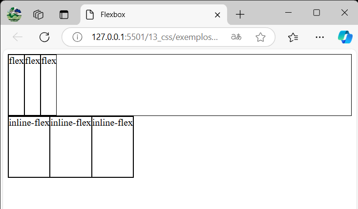

---
- Na imagem anterior, note que a primeira `div` é um elemento de bloco e também um **container flex**.
    - os três elementos estão aglutinados no lado direito(é possível alterar esse comportamento)

- A segunda `div`, por outro lado, ocupa apenas o espaço necessário para gaurdar os elementos filhos. Esta div também é um container flex.

- Em ambos os casos, os itens flex (filhos das divs container) tem a largura definida para o conteúdo (texto).

---

<style scoped>
    section {
        display: flex;
        flex-direction: column;
        justify-content: center;
        text-align: center;
    }
</style>

# Container Flex

---
## Container Flex

- É importante notar do Exemplo 01 que ao definirmos a propriedade `display: flex`, estamos indicando que **dentro** do container os elementos terão comportamento de **itens flex**.
- Há um conjunto de propriedades ao nível de container flex e também ao nível de item flex.
- O flexbox permite construir layout de forma direcional sobre dois eixos: **main-axis** e **cross-axis**.

---

## Container Flex

- Os itens flex são acomodados no container de modo direcional. Isso significa que eles são acomodados em uma única dimensão horizontal ou vertical.
- Há dois eixos que orietam o desenho dos itens: **main-axis** e **cross-axis** (eixo principal e eixo perpendicular).
- Por padrão, o desenho dos elementos começa da esquerda para direita do topo para baixo. 
- Veja a imagem a seguir que ilustra a ideia de eixos.

---

<style scoped>
    img {
        margin: 0 25%;
        margin-bottom: 40px;
    }
    p {
        position: absolute;
        bottom: 80px;
    }
</style>

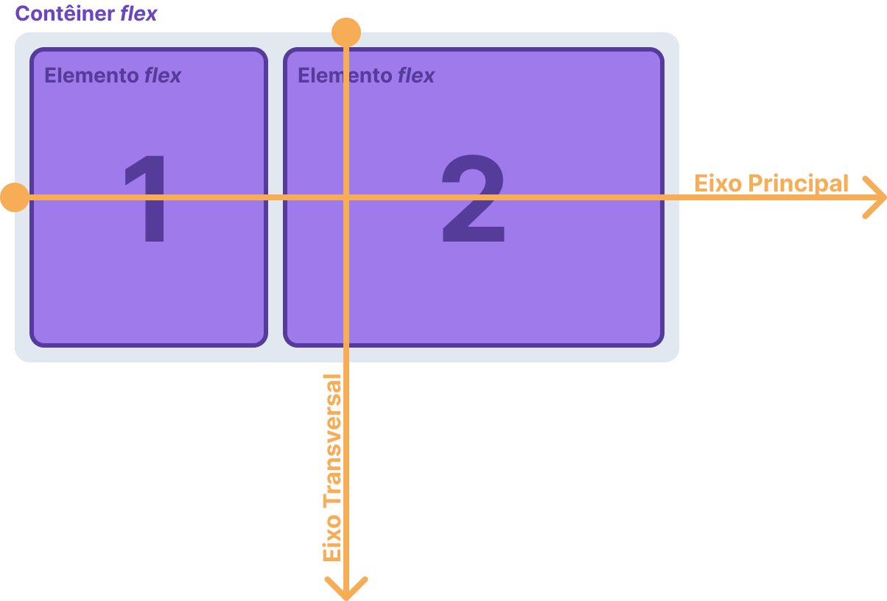

Fonte: [https://triangulo.dev/posts/guia-completo-flexbox/](https://triangulo.dev/posts/guia-completo-flexbox/)

---

##  Container Flex

- O container flex é direcional. Ele adiciona os elementos no eixo principal da esquerda para direita (podemos alterar isso).

- Caso seja necessário (e programado), pode haver múltiplas linhas com os elementos sendo adicionados no sentido do eixo transversal.

- Duas propriedades de container que permitem trabalhar bem com acomodação dos elmemento são:
    - `flex-direction`
    - `flex-wrap`

---

## Container Flex - Flex Direction

- Este propriedade tem como valor padrão `flex-direction: row`.
- O eixo principal padrão conforme a figura é uma linha da esquerda para direita.
- Logo, a direção dos itens acomodados é em linha.
- O [Exemplo 2](https://github.com/RomeritoCamposProjetos/design2024/tree/main/slides/13_Css/exemplos/ex2.html) mostra a configuração de `flex-direction: column` junto a forma padrão.
- No slide a seguir, veja o resultado.

---

<style scoped>
    img {
        border: 1px solid black;
        border-radius: 15px;
        margin: 0 12%;
    }
</style>

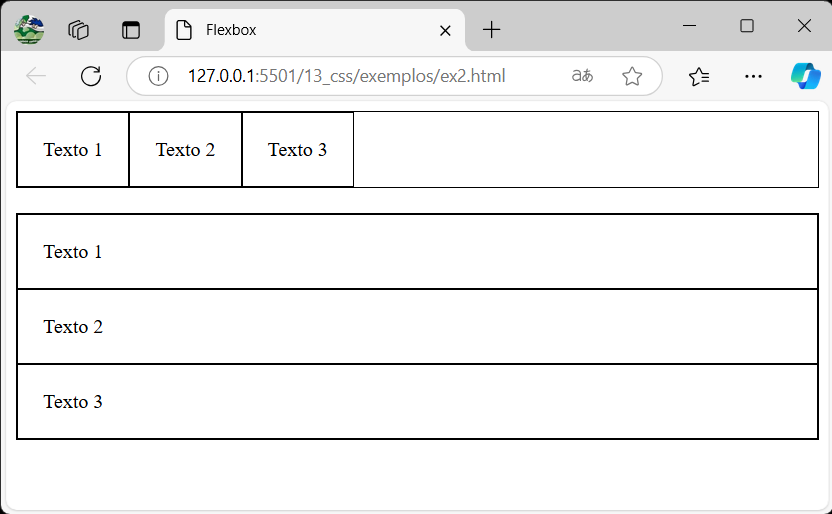

---

- Na imagem do slide anterior temos:
    - duas divs
    - cada uma delas contém três divs com texto iguais.

- No primeiro caso, a propriedade flex-direction está definida como padrão: `flex-direction: row`

- No segundo caso, flex-direction foi definida para `flex-direction: column`.

- A forma como os elementos foram estruturados deixa claro. Primeiro em linha (padrão) e segundo em coluna.

---

## Container Flex - Flex Direction

- Além de existir as opções `row` (padrão) e `column`, é possível utilizar versões que fazem o mesmo comportamento de linha e coluna. Entretanto, de forma reversa.

- Pode-se desenhar os itens flex dentro do container de maneira reversa:
    - `flex-direction: row-reverse`
    - `flex-direction: column-reverse`

- Vejamos o [Exemplo 3](https://github.com/RomeritoCamposProjetos/design2024/tree/main/slides/13_css/exemplos/ex3.html) no próximo slide.

---
<style scoped>
    img {
        border: 1px solid black;
        border-radius: 15px;
        margin: 0 12%;
    }
</style>

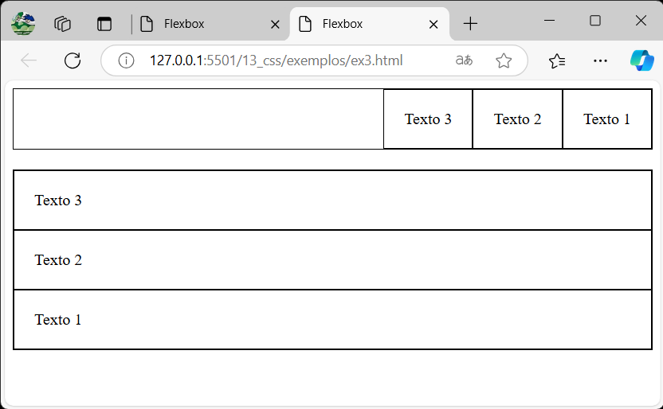

---

- Na imagem do slide anterior, note que a ordem dos elementos está invertida.
- Este é o comportamento reverso. 
- No caso de `row-reverse`, temos a direção do eixo principal ao contrário saindo da direta para a esquerda.
- Já para `column-reverse`, o eixo principal vai do `bottom` em direção ao `top`. Grosso modo, de baixo para cima.

- Há situações onde essas possibilidades podem ser bastante úteis. Imagine um menu horinzontal, por exemplo que seja alinhado a direita.

---

## Container Flex - Flex Wrap

<style scoped>
    img {
        margin: 0 15%;
        border: 1px solid black;
        border-radius: 15px;
    }
    ul, li {
        margin: 0;
    }

</style>

- Para compreendermos esta propriedade vejamos o [Exemplo 4](https://github.com/RomeritoCamposProjetos/design2024/tree/main/slides/13_css./exemplos/ex4.html)

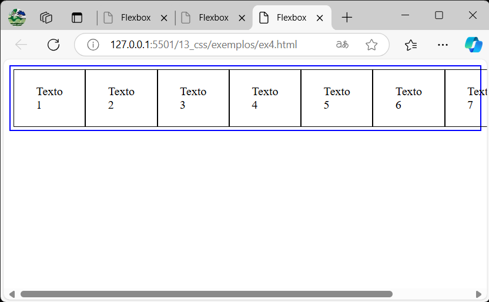

---

- Na imagem temos um container flex (borda azul) que possui a largura igual a do viewport.
- Entretanto, os itens flex do container não cabem todos dentro do container.
- Por padrão, acontece um `overflow`. Os elementos são desenhados fora do container seguindo a linha do eixo principal (o container tem `flex-direction: row`).
- O resultado é uma barra de rolagem na horizontal.
- É aqui que entra a propriedade `flex-wrap`. Ela permite controlar este tipo de situação.
- Veja o [Exemplo 5](https://github.com/RomeritoCamposProjetos/design2024/tree/main/slides/13_css/exemplos/ex5.html) e a imagem a seguir.
---

<style scoped>
    img {
        margin: 0 12%;
        border: 1px solid black;
        border-radius: 15px;
    }
</style>

- Observe como espaço foi corretamente adaptado.
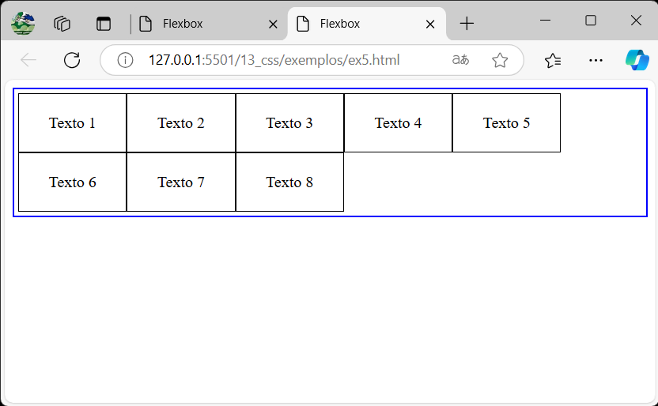

---

<style scoped>
    pre + ul { 
        margin: 0;
    }
</style>

- O código que produz a imagem anterior é bem simples:

```css
.row {
    display: flex;
    flex-wrap: wrap;
}
```

- Define-se o container como flex e garante que os elementos vão criar uma nova linha quando a primeira linha for ocupada. 

- O valor padrão para wrap é `flex-wrap: no-wrap`. Ele não precisa ser declarada.

- É possível obter o comportamento reverso: `flex-wrap: wrap-reverse`

---

<style scoped>
    img {
        margin: 0 12%;
        border: 1px solid black;
        border-radius: 15px;
    }
</style>

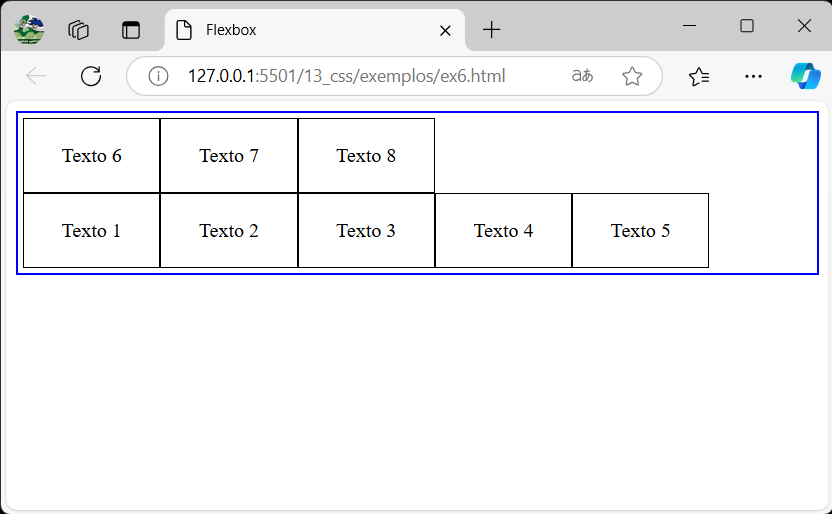

- [Exemplo 6](https://github.com/RomeritoCamposProjetos/design2024/tree/main/slides/13_css/exemplos/ex6.html): `flex-wrap: wrap-reverse`
---

<style scoped>
    img {
        margin: 0;
    }
    ul, li {
        margin: 0;
    }
</style>

- No exemplo anterior, a linha começa sendo feita de baixo para cima. 
- Por exemplo, neste caso serão produzidas 2 linhas. Então, as linhas são desenhadas da última para a primeira linha.
- Como exercício: aplique flex-wrap com flex-direction e explore as possibilidades dessa combinação.
- O que acontece se colocamos,  por exemplo, a seguinte combinação?

```css
.row {
    display: flex;
    flex-wrap: wrap-reverse;
    flex-direction: row-reverse;
}
```

---

## Container Flex - Distribuição de epaço

- Há duas formas de organizar a distribuição de espaço em um container flex considerando:
    - o eixo horizontal (**main** - principal): `justify-content`;
    - o eixo vertical (**cross** - transversal): `align-items` e `align-content`.

- Há uma terceira maneira que será discutida na parte referente a itens flex: `align-self`.

---

## Container Flex - Justify-content

- Esta properidade admite 6 valores diferentes
    - `flex-start` (padrão)
    - `flex-end`
    - `space-between`
    - `space-around`
    - `space-evenly`
    - `center`

- Reveja o [Exemplo 1](https://github.com/RomeritoCamposProjetos/design2024/tree/main/slides/13_css/exemplos/ex1.html) novamente no próximo slide.

---

<style scoped>
    img {
        border: 1px solid black;
        border-radius: 10px;
        margin: 0 15%;
        float: right;
    }
</style>


---

- Foque na primeira linha. Ela possui três divs cada uma com um texto 'flex'.
- Perceba que cada item flex ocupa todo o espaço vertical da linha.
- Isso acontece porque a propriedade padrão para justify-content é `justify-content: flex-start`
- Todos os elementos vão ocupar o início da linha.

- [Exemplo 07](https://github.com/RomeritoCamposProjetos/design2024/tree/main/slides/13_css/exemplos/ex7.html) mostra três valores diferentes para `justify-content`.

---

<style scoped>
    img {
        border: 1px solid black;
        border-radius: 10px;
        margin: 0 15%;
        float: right;
    }
</style>

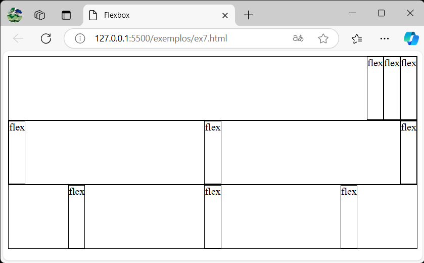

---

- Na imagem anterior, temos três containers flex, um em cada linha.
- O primeiro container está configurado com `justify-content: flex-end`. Neste caso, os itens flex são alinhados no canto a direita (o fim do eixo principal).
- O segundo container está configurado com `justify-content: space-between`. Neste caso, uma quantidade igual de espaço é alocada entre os elementos.
- O terceiro container está configura com `justify-content: space-around`. Neste caso, o espaço antes do primeiro item e depois do último item é a metade do espaço entre os demais. 

---

<style scoped>
    img {
        border: 1px solid black;
        border-radius: 10px;
        margin: 0 15%;
        float: right;
    }
</style>

- O [Exemplo 08](https://github.com/RomeritoCamposProjetos/design2024/tree/main/slides/13_css./exemplos/ex8.html) mostra mais duas possibilidades para a propriedade.

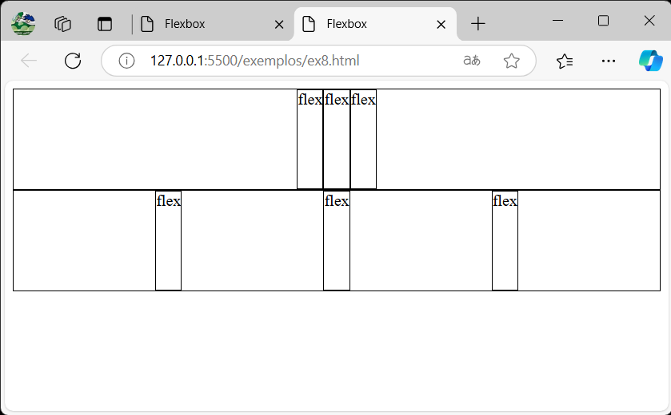

---

- Na imagem anterior, há dois containers flex.

- O primeiro container utiliza `justify-content: center`. Desta maneira, centraliza os elementos dentro do container.

- O segundo container utiliza `justify-content: space-evenly`. Neste caso, os espaços entre os elementos é dividido de forma igual (diferentemente de `space-between`).

- Como exercício, aplique esta propriedade em colunas, colunas reversas e linhas reversas. Veja como vai se comportar cada uma delas.

---

## Container Flex - align-items

<style scoped>
    ul + p {
        margin-top:-20px;
        background-color: yellow;
        height: fit-content;
        text-align: center;
        padding: 20px;
        border-radius:25px;
        font-size: 32px;
    }
</style>

- A propriedade `justify-content` permite manipular a distribuição de espaço dos elementos no eixo principal (**main**).

- Entretanto, podemos distribuir o espaço no eixo transversal (**cross**).

- A propreidade `align-items` permite fazer os ajustes no eixo transversal.

`align-items` altera a distribuição de espaço para um grupo de itens flex dentro de um container. Estabele o valor `align-self` para todos.

---

- A propriedade `align-items` suporta os seguintes valores:
    - `stretch` (padrão) 
    - `center` 
    - `start` - também suporta `flex-start`
    - `end` - também suporta `flex-end`
     
- O valor padrão desta propriedade implica que o elemento vai ficar esticado no eixo transversal.

- O [Exemplo 09](https://github.com/RomeritoCamposProjetos/design2024/tree/main/slides/13_css/exemplos/ex9.html) mostra as propriedades `center`, `start` e `end`. Veja a imagem a seguir.

---

<style scoped>
    img {
        border: 1px solid black;
        border-radius: 10px;
        margin: 0 15%;
        float: right;
    }
</style>

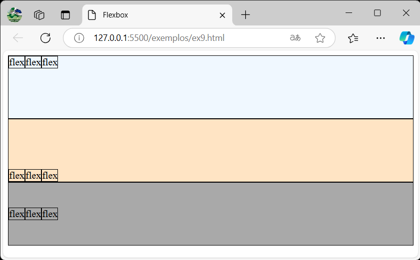

---

- O primeiro container alinha os elementos com `start` (`flex-start`). Eles ocupam a parte inicial da linha considerando o eixo transversal (**cross**). Na vertical.

- O segundo container alinha os elementos com `end` (`flex-end`). Eles estão na parte inferior do container considerando o eixo transversal.

- Por fim, o último container alinha os elementos no centro com `center`. 

- Estes são alinhamentos que são aplicados ao grupo de itens do container.

---

## Container Flex - Baseline

- Há também o alinhamento baseado em linha. 

- O [Exemplo 10](https://github.com/RomeritoCamposProjetos/design2024/tree/main/slides/13_css/exemplos/ex10.html) mostra como ele ajuste os elementos com base na linha de texto.

- A propriedade `text-align: baseline` é aplicada para obter o alinhamento baseado em linhas.

- Veja a imagem a seguir.

---

<style scoped>
    img {
        border: 1px solid black;
        border-radius: 10px;
        margin: 0 15%;
        float: right;
    }
</style>

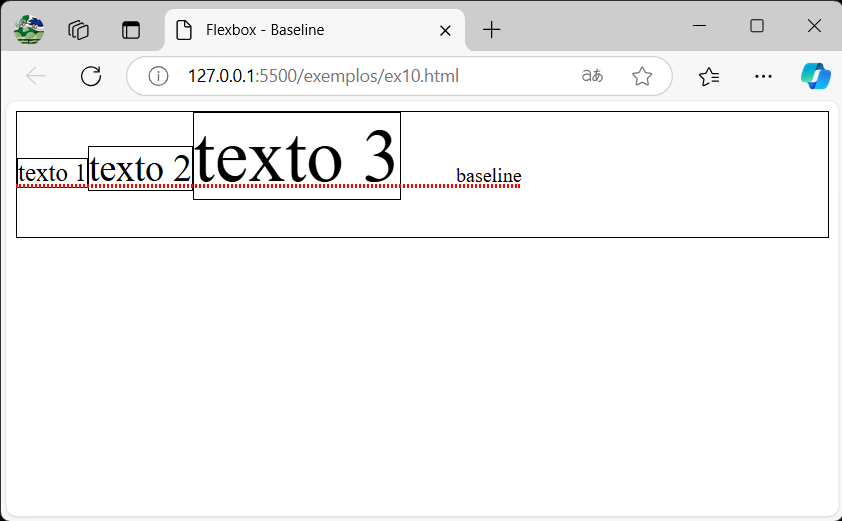

---

- O alinhamento baesado em linha, considera uma linha conforme foi desenhada no exemplo.

- Os elementos são alinhados com base nesta linha. 

- Há outras opções de alinhamento baseado em linha. Abaixo segue:

```css
align-items: baseline;
align-items: first baseline;
align-items: last baseline; /* Overflow alinhamento (apenas para alinhamento de posição) */
align-items: safe center;
align-items: unsafe center;
```
- Baixe o código do exemplo e teste estes valores.

---

## Container Flex - align-content

<style scoped>
    img {
        border: 1px solid black;
        border-radius: 10px;
        margin: 0 15%;
        float: right;
    }
</style>

- A propriedade `align-content` atua no eixo transversal (**cross**).

- Esta propriedade considera um cenário com múltiplas linhas.

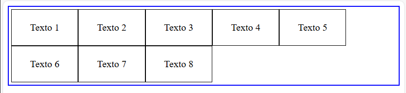

- Ela pode ser aplicada a um cenário como o desta imagem onde o container tem mais de uma linha.

---

## Container Flex - align-content

<style scoped>
    ul, li {
        margin: 0
    }
</style>


- É importante não confudir `align-content` com `align-items`.

- A propriedade `align-content` suporta os seguintes valores:
    - `start` | `flex-start`
    - `end` | `flex-end`
    - `center` 
    - `baseline`
    - `space-between`
    - `space-around`
    - `space-evenly`
---

<style scoped>
    img {
        border: 1px solid black;
        border-radius: 10px;
        margin: 0 15%;
        float: right;
    }
</style>

- O [Exemplo 11](https://github.com/RomeritoCamposProjetos/design2024/tree/main/slides/13_css/exemplos/ex11.html) mostra os elementos sem `align-content` definido.

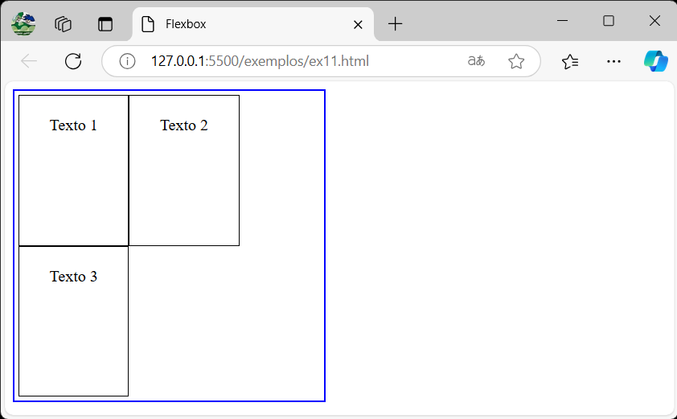

---

<style scoped>
    section {
        display: flex;
        flex-direction: column;
        justify-content: center;
        text-align: center;
    }
</style>

# Itens Flex

---

## Itens Flex

- O segundo elemento fundamental do Flexbox é o **item flex**

- Qualquer elemento dentro de um container flex é um item flex.

- A relação entre container e item flex é a relação pai-filho presente na estrutura do HTML. Os demais descendentes de um container flex não são considerados itens em relação ao container.

- Há propriedades para otimizar o uso do espaço do container e também existem propriedades para alterar o comportamento padrão dos itens flex.

---

## Itens Flex

- As três principais propriedades dos itens flex são:
    - `flex-grow`: indica o crescimento dos itens;
    - `flex-shrink`: indica o encolhimento dos itens;
    - `flex-basis`: porção inicial do eixo principal a ser ocupada.

- As propriedades `flex-grow` e `flex-shrink` adotam um **fator de crescimento**.

- A propriedade `flex-basis` assume diferentes valores como 200px, 0, auto, 0% entre outros.

---

## Itens Flex: flex-grow

<style scoped>
    ul, li {
        margin: 0;
    }
    img {
        border: 1px solid black;
        border-radius: 10px;
        margin: 0 20%;
        float: right;
    }
</style>

- O [Exemplo 12](https://github.com/RomeritoCamposProjetos/design2024/tree/main/slides/13_css/exemplos/ex12.html) contém referente a figura abaixo: 

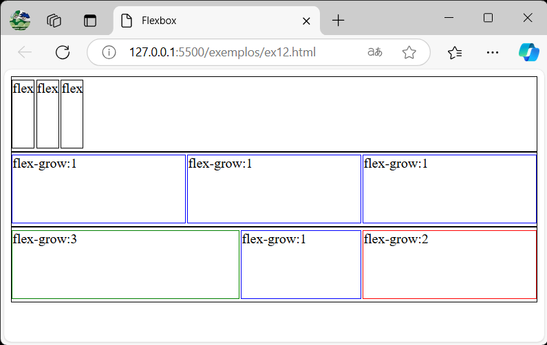

---

- Na imagem anterior, temos 3 containers. Cada um com seus itens possuindo diferentes configurações para a propriedade `flex-grow`
- O primeiro caso, `flex-grow:0`. Logo, os itens não ocupam o espaço livre.
- No segundo e terceiro casos, os itens indicam o `flex-grow` utilizado.
- Observe a diferença de distribuição entre os itens nos containers. Isso se deve ao fator de crescimento utilizado.
- Por coincidência, há dois itens com `flex-grow` diferentes, mas ocupado o mesmo espaço. **Quando analisamor o cálculo do fator entenderemos melhor.**

---

## Itens flex: flex-shrink

- Também há um fator de encolhimento dos itens: o valor padrão é `flex-shrink: 1`. Sempre encolher.
- Trata-se da propriedade `flex-shrink`. Ela permite o quanto cada item flex vai enconlher diante de situações onde os itens não cabem no container.
- Vejamos o [Exemplo 13](https://github.com/RomeritoCamposProjetos/design2024/tree/main/slides/13_css/exemplos/ex13.html) com um container de 400px de largura (eixo principal) e 7 itens com 80px de largura cada um.
- Se você fez as contas já sabe o que acontece. Vejamos o próximo slide.

---

<style scoped>
    ul, li {
        margin: 0;
    }
    img {
        border: 1px solid black;
        border-radius: 10px;
        margin: 0 15%;
        float: right;
    }
</style>

- Resultado do [Exemplo 13](https://github.com/RomeritoCamposProjetos/design2024/tree/main/slides/13_css/exemplos/ex13.html)

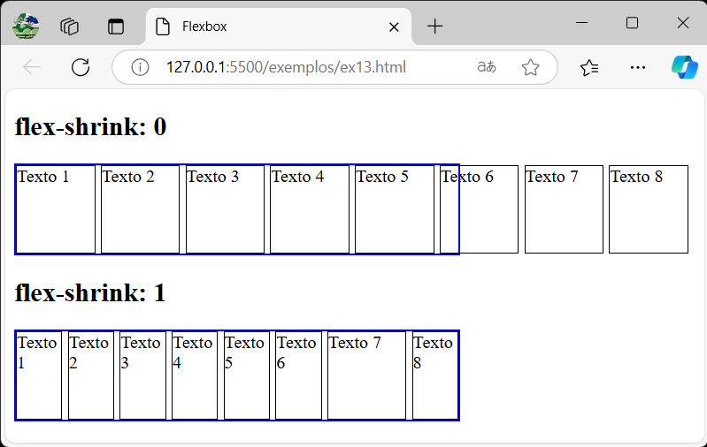


---

- No slide anterior, observe que no primeiro container os itens tem a propriedade `flex-shrink: 0` e `width: 70px`. Logo, tem overflow e os itens ficam fora do container.

- No segundo container, os itens de 1 até 6 e o item 8 tem a propridade `flex-shrink: 1`. Eles encolhem e todos os itens cabem no container. 

- O item 7 do segundo container não tem `flex-shrink: 1`, logo força a largura indicada de 70px.

- A conclusão deste exemplo é que o flex oferece a capacidade de indicar se o item vai encolher (padrão) ou não.

---

## Itens flex - flex-basis

- A definição da propriedade indica que ela define um espaço inicial que o elemento ocupará no eixo principal (main).

- Esta propriedade possui diferentes condicionantes para seu comportamento a depender do valor atribuido e fatores envolvendo outras propriedades.

- Neste ponto, veremos apenas o comportamento básico que é definido um valor em pixel para o elemento.

---

<style scoped>
    ul, li {
        margin: 0;
    }
    img {
        border: 1px solid black;
        border-radius: 10px;
        margin: 0 15%;
        float: right;
    }
</style>

- O [Exemplo 14](https://github.com/RomeritoCamposProjetos/design2024/tree/main/slides/13_css/exemplos/ex14.html) mostra alguns possibilidades para `flex-basis`

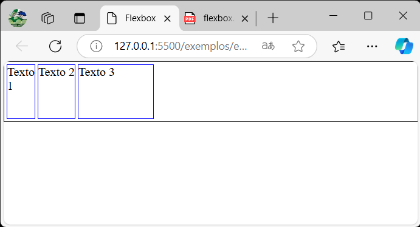

---

- O item com Texto 1 está com flex-basis configurado para 0: `flex-basis: 0`. Neste caso, ele vai ocupar o espaço mínimo no eixo principal.

- O item com Texto 2 está com flex definido para o valor padrão: `flex-basis: auto`.

- O item com Texto 3 está com flex-basis definido para 100px: `flex-basis: 100px`.
    - Neste último caso, temos que o item vai tentar utilizar o espaço do container para ter pelo menos os 100px definidos. Ele pode crescer se `flex-grow: 1`.

---

## Propriedade flex

- Até aqui 3 propriedades básicas para alteração de um item flex foram apresentas: `flex-grow`, `flex-shrink` e `flex-basis`.

- De acordo com os autores da especificação, o ideal é evitar o uso delas individualmente.

- Para isso, há a propriedade `flex` que pode ser usada para indicar os valores de `flex-grow`, `flex-shrink` e `flex-basis` simultaneamente.

- Exemplo: `flex: 1 1 200px`, indica `flex-grow: 1`, `flex-shrink: 1` e `flex-basis: 200px`.


---

# Referências

https://triangulo.dev/posts/guia-completo-flexbox/

https://developer.mozilla.org/en-US/docs/Web/CSS/CSS_flexible_box_layout/Basic_concepts_of_flexbox