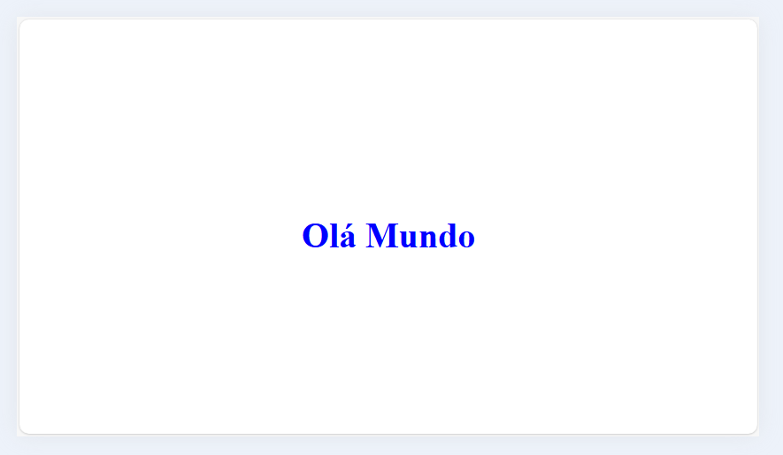

# Design Web e Arquitetura da Informação
Prof. Romerito Campos

---

# Plano de Aula

- **Objetivo:** Compreender o uso de @media em designs responsivos

- **Conteúdos**:
    - @media, @import
    - Tipos de mídia 
    - Recursos de mídia (*media feature*)

---

<style scoped>
    section {
        display: flex;
        flex-direction: column;
        justify-content: center;
        text-align: center;
    }
</style>

# Regras @


---
## Regras @ 

- As regras `@` ou **At-Rules** são regras que podem ser definidas com base em condicionais.

- Elas são aplicadas quando determinadas características são encontadas pelo browser que está lendo o arquivo css.

- Dentro deste contexto temos as ***Media Queries*** que permitem aplicar estilos com base no tipo de tela e sob um conjunto de condições

---
## Regras @ 

- No [exemplo 01](https://github.com/RomeritoCamposProjetos/design2024/tree/main/slides/14_css/exemplos/ex01) temos dois conjuntos de regras para o documento
  - Primeiro, definido na tag `style`;
  - Segundo, definido em arquivo externo.`style-print.css` e incluido no documento.

- Destaque para o tipo de media indicado na inclusão do arquivo css:

```html
<link rel="stylesheet" href="style-print.css" media="print">
``` 

**As regras css no arquivo incluído serão aplicadas apenas no modo de impressão**

---

## Regras @

- O tipo de mídia pode ser indicado tanto na tag `style` como na tag `link` (exemplo anterior).

- Os três tipos de mídia mais utilizados são:
  - `all` (padrão)
  - `screen`: monitores, telas em geral.
  - `print`: impressão ou visualização de impressão

- A indicação do tipo de mídia pode ser feita dentro do próprio arquivo css, vejamos.

---

<style scoped>
    section {
        display: flex;
        flex-direction: column;
        justify-content: center;
        text-align: center;
    }
</style>

# @import

---
## @import

<style scoped>
    pre {
        width: 48%;
        float: left;
        margin-left: 5px;
        margin-top: 0
    }
    ul:last-of-type {
        margin-bottom: 0
    }
</style>

- No [exemplo 02](https://github.com/RomeritoCamposProjetos/design2024/tree/main/slides/14_css/exemplos/ex02), temos a inclusão via tag `link` de duas folhas de estilos para mídia `screen` e `print`.

- É possível incluir os dois arquivos de folha de estilos e um único arquivo e depois adicioná-lo ao HTML.
  - O [Exemplo 03](https://github.com/RomeritoCamposProjetos/design2024/tree/main/slides/14_css/exemplos/ex03) faz este tipo de abordagem. Veja abaixo:

- A regra `@import` permite este tipo de agrupamento de folha de estilos. 
```css
/* arquivo styles.css */
@import url('./style-print.css') print;
@import url('./style-screen.css') screen;
```

```html
<!-- arquivo index.html -->
<link rel="stylesheet" href="styles.css">
```

---

<style scoped>
    section {
        display: flex;
        flex-direction: column;
        justify-content: center;
        text-align: center;
    }
</style>

# Media Queries

---


## @media

- Uma regra muito importante entre as regras `@` é a `@media`

- Com ela podemos vincular regras css a tipos de mídia e considerar também condicionantes.

- Vejamos o [exemplo 04](https://github.com/RomeritoCamposProjetos/design2024/tree/main/slides/14_css/exemplos/ex04)
  - Este exemplo é similar ao exemplo 4: dois estilos para `screen` e `print`
  - Entretanto, utilizamos apenas uma folha de estilos que é o arquivo [style.css](https://github.com/RomeritoCamposProjetos/design2024/tree/main/slides/14_css/exemplos/ex04/style.css)

---

## @media

- Na folha de estilos [style.css](https://github.com/RomeritoCamposProjetos/design2024/tree/main/slides/14_css/exemplos/ex04/style.css) definimos um bloco que está apresentado abaixo.

```css
@media print {
    .navbar {display: none;}
    .card {
        width: 100%;
        border: 1px solid black;
        margin: 10px 0px;
    }
    .card > p {text-align: justify;}
    .main {flex-direction: column;}
}
```

---

## @media

- Observe a primeira linha do código do slide anteior: `@media print`.

- Indicamos que as regras dentro do bloco `@media` serão aplicadas ao tipo de mídia `print`

- Neste exemplo, não utilizamos a regra `@import`, embora o efeito seja o mesmo.

- Tenha em mente que a regra `@media` terá um papel muito maior do que apenas preparar a página para impressão. 

---

## Media Queries Complexas

- Além do tipo de mídia (`screen`, `print`) podemos incluir na composição da regra `@media` recursos que o navegador pode identificar.

- Para tanto, utilizamos operadores lógicos **and** e **not**.

- Desta forma, é possível indicar o tipo de mídia mais (+) algum recurso (***feature***). 

- Veremos um recurso chamado `color`, que indica impressora ou monitor com cores. 


---
## Media Queries Complexas

- O trecho de código abaixo indica o tipo de media (`print`) e o recurso (`color`).
```html
<link href="print-color.css" media="print and (color)" rel="stylesheet">
```
- Neste exemplo, temos uma media query complexa no sentido de agrupar elementos desejáveis para o design.
- `@import` também pode expressar tal combinação
```css
@import url(print-color.css) print and (color)
```
---

## Recursos de Mídia (media feature)

- Os recursos de mídia como o exemplo `color` constituem características do agente do usuário (browser) ou dispositivo de saída (impressora).

- Esta [lista](https://developer.mozilla.org/en-US/docs/Web/CSS/@media#media_features) possuem os *media features* disponíveis. 
  - Atenção para aqueles que são ***deprecated*** (uso abandonado)

- O media feature `orientation` aceita dois valores: `portrait` e `landscape`. Neste [link](https://developer.mozilla.org/en-US/docs/Web/CSS/@media/orientation#syntax) tem as definições de cada valor.

---

## Recursos de Mídia (media feature)

- Os media features podem ter um valor dentro de uma faixa.
- Por exemplo, `width`.
  - Há duas variações que são `min-width` e `max-width`

- O uso de largura e altura é bem comum, principalmente no que diz respeito a sites responsivos (quem tem a capacidade de adaptação do design a diferentes screens)

- Vejamos exemplos simples do uso de mídia com *media features*

---

## Recursos de Mídia (media feature)

<style scoped>
    img {
        float: left;
        margin-left:20%
    }
</style>

- O [exemplo 05](https://github.com/RomeritoCamposProjetos/design2024/tree/main/slides/14_css/exemplos/ex05) mostra uma aplicação que só exibe uma mensagem. 

- Para ver o exemplo de forma clara abra o navegador no modo responsivo:
    - No chrome, use o atalho **ctrl + shif + c**.




---

- O exemplo anterior tem código CSS bem simples conforme você pode ver abaixo:

```css
body {
    height: 100vh;
}
.container {
    height: 100%;
    background-color: blue;
    display: flex;
    justify-content: center;
    align-items: center;
}
.contiainer > h1 {
    color: white;
}
```
---

- No entanto, para realizar a mudança de cores adotamos o uso de `@media` onde indicamos o tipo de tela para `screen` e aplica-se um *media feature*. Veja o código: 

```css
@media screen and (orientation: landscape) {
    .container {
        background-color: white;
    }

    .container > h1 {
        color: blue;
    }   
}
```

- **Recomenda-se executar e usar o modo responsivo**

---

- O exemplo anterior é extramente simples.

- Entretanto, veja que podemos pensar mais adiante e associar os designs de páginas completas com a capacidade de adaptar-se a tela disponível.

- Essa capacidade é alcançada manipulando os elementos HTML e altearndo o CSS conforme as características do dispositivo.

- O recurso fundamental como vimos é o `@media` que permite criar blocos condicionados a características dos dispositivos.

---

<style scoped>
    section {
        display: flex;
        flex-direction: column;
        justify-content: center;
        text-align: center;
    }
</style>

# Estilo Responsivo

---
## Estilo Responsivo

- O design responsivo visa a criar designs capazes de serem usados numa faixa ampla de dispositivos (móveis, desktop)

- Atualmente, a distinção entre dispositivos móveis e desktops está um tanto nebulosa.
    - O CSS ainda não possui capacidade de saber se o disposivo está na palma da sua mão enquanto você caminha, por exemplo.

- Uma forma de alcançar o **design responsivo** é justamente observar características do dispositivo como `orientation`, `max-width` e etc.

---

## Estilo responsivo

- No código disponível no github - [neste link](https://github.com/RomeritoCamposProjetos/design2024/tree/main/slides/14_css/exemplos/exemplo-responsivo) - há um exemplo de design responsivo.

- Baixe o código e execute via `Live Server` ou algum servidor de linguangens como python ou php.

- Ao executar, veja a versão inicial para desktop e em seguida use o atalho **Ctrl + Shift + C** e explore os dispositivos disponíveis.

- A seguir algumas imagens do resultado obtido

---


---

<style scoped>

    section {
        display: flex;
        flex-flow: column wrap;
    }

    img {
        float: left;
    }
</style>


